## NL2Diagram Prompt Assembly Template (PlantUML behavioral diagrams)

Assemble the retrieved YAML knowledge chunks (syntax + rules + examples) into the final prompt for the LLM. Principles: short rules first, renderability first, correct block closure first.

### Inputs
- Natural-language request: {nl_request}
- Target diagram type (from router): {diagram_type}
- Retrieved chunks (top-k): {retrieved_chunks}

### Output Constraints (strict)
1. Output exactly one PlantUML code block and include @startuml and @enduml
2. Use the code fence language tag plantuml
3. Do not output explanations, steps, or analysis

### Assembly Structure (recommended)

System / Developer:
- You are a PlantUML expert. Your goal is to generate a renderable and structurally correct behavioral diagram.
- If information is missing, fill reasonable defaults. Do not output placeholders like TODO.

User:
Task:
Generate PlantUML for a {diagram_type} diagram.

Requirements:
{nl_request}

Available Syntax and Rules (retrieval results):
Paste the following in priority order:
- rules from each chunk (if any)
- syntax skeletons from each chunk
- at most 1 example that best matches the request (if any)

Output format:

```plantuml
@startuml
...
@enduml
```

### Fallback Rules (recommended as the last rules)
- Always close blocks properly (e.g., end for sequence fragments; endif/end fork/endwhile for activity; braces for state)
- When unsure, fall back to the simplest renderable structure (avoid advanced features)
